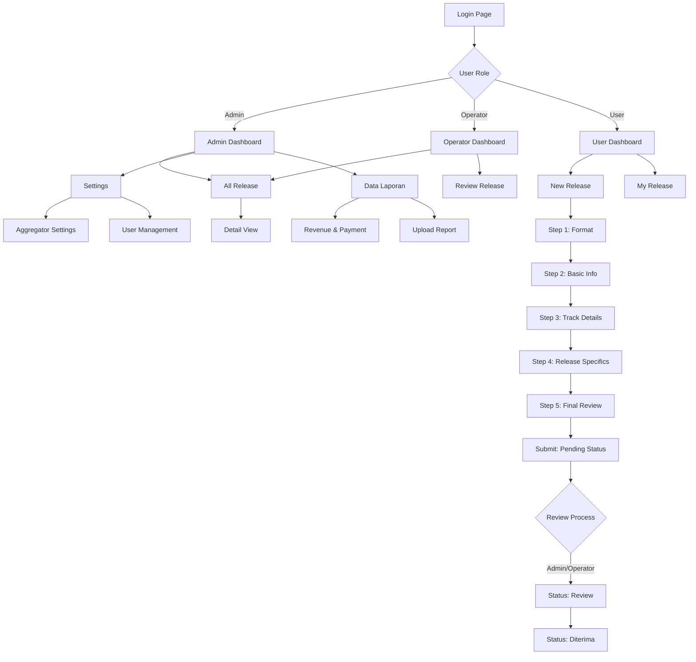

## 1. Product Overview

Sistem CMS Aggregator Musik adalah platform manajemen distribusi musik digital yang memungkinkan artist untuk mengupload dan mendistribusikan karya musik mereka ke berbagai platform streaming. Aplikasi ini menyediakan proses upload bertahap dengan validasi ketat dan sistem approval untuk memastikan kualitas konten yang didistribusikan.

Platform ini dirancang untuk membantu artist independen dan label rekaman dalam mendistribusikan musik mereka secara profesional dengan alur kerja yang jelas dan transparan. Sistem ini juga menyediakan fitur pelaporan dan revenue tracking untuk memonitor performa setiap rilis musik.

## 2. Core Features

### 2.1 User Roles

Sistem ini memiliki 3 role pengguna dengan hak akses yang berbeda:

| Role          | Registration Method                | Core Permissions                                                                             |
| ------------- | ---------------------------------- | -------------------------------------------------------------------------------------------- |
| Admin         | Manual registration oleh developer | Full access ke semua fitur termasuk setting aggregator, approval release, dan manajemen user |
| Operator      | Diundang oleh admin                | Bisa review release dan ubah status ke Review/Diterima                                       |
| User (Artist) | Self-registration via email        | Bisa upload release miliknya sendiri dan melihat status rilis                                |

### 2.2 Feature Module

Sistem CMS Aggregator Musik terdiri dari halaman-halaman utama berikut:

1. **Dashboard**: Tampilan overview dengan statistik dan quick access ke fitur utama
2. **New Release**: Form upload bertahap (5 step) untuk rilis musik baru
3. **All Release**: Daftar semua rilis dengan filter dan sorting
4. **Data Laporan**: Statistik, revenue tracking, dan payment management
5. **Settings**: Konfigurasi aggregator dan manajemen user

### 2.3 Page Details

| Page Name    | Module Name                | Feature description                                                          |
| ------------ | -------------------------- | ---------------------------------------------------------------------------- |
| Dashboard    | Statistics Overview        | Tampilkan total release, total user, total revenue, dan chart status release |
| Dashboard    | Quick Actions              | Shortcut ke new release dan all release                                      |
| New Release  | Step 1 - Format Selection  | Pilih tipe rilis (Single/Album) dengan validasi jumlah track                 |
| New Release  | Step 2 - Basic Info        | Upload cover, input metadata (title, artist, label, genre, dll)              |
| New Release  | Step 3 - Track Details     | Upload audio WAV dan clip, input track metadata, maksimal 15 track           |
| New Release  | Step 4 - Release Specifics | Pilih previous distribution dan set release date                             |
| New Release  | Step 5 - Final Review      | Preview semua data sebelum submit dengan status awal Pending                 |
| All Release  | Release Table              | Tampilkan daftar rilis dengan cover, title, artist, type, status             |
| All Release  | Detail View                | Tampilkan metadata lengkap dan track details                                 |
| Data Laporan | Statistics                 | Chart dan grafik performa rilis                                              |
| Data Laporan | Revenue List               | Daftar revenue per rilis dengan filter date dan user                         |
| Data Laporan | Payment Management         | Kelola pembayaran ke artist dengan status Paid/Unpaid                        |
| Data Laporan | Report Upload              | Upload laporan CSV/Excel untuk parsing otomatis                              |
| Settings     | Aggregator Settings        | CRUD untuk daftar aggregator                                                 |
| Settings     | User Management            | CRUD untuk manajemen user dan role assignment                                |

## 3. Core Process

### User Flow (Artist)

1. User login ke dashboard
2. Klik "New Release" untuk memulai proses upload
3. Step 1: Pilih format (Single/Album)
4. Step 2: Upload cover dan isi basic info
5. Step 3: Upload track audio dan metadata
6. Step 4: Set release specifics dan tanggal rilis
7. Step 5: Review dan submit release (status: Pending)
8. Monitor status rilis di halaman All Release

### Admin Flow

1. Login sebagai admin dengan full access
2. Review release yang statusnya Pending
3. Ubah status menjadi Review atau Diterima
4. Jika status Review, pilih aggregator dari dropdown
5. Kelola aggregator settings dan user management
6. Upload laporan revenue dan kelola pembayaran

### Operator Flow

1. Login sebagai operator
2. Akses halaman All Release untuk review
3. Ubah status release dari Pending ke Review
4. Update status menjadi Diterima jika sudah sesuai

## 4. User Interface Design

### 4.1 Design Style

* **Primary Colors**: Blue (#3B82F6) untuk primary actions dan header

* **Secondary Colors**: Gray (#6B7280) untuk teks sekunder, hijau (#10B981) untuk status diterima, orange (#F59E0B) untuk pending, merah (#EF4444) untuk error

* **Button Style**: Rounded corners dengan shadow subtle, hover effect dengan transisi smooth

* **Font**: Inter atau sans-serif modern, ukuran 14px untuk body text, 16px untuk heading

* **Layout Style**: Sidebar navigation tetap di kiri, konten utama di kanan dengan card-based layout

* **Icons**: Heroicons atau Lucide React untuk konsistensi ikon modern

### 4.2 Page Design Overview

| Page Name   | Module Name      | UI Elements                                                                                            |
| ----------- | ---------------- | ------------------------------------------------------------------------------------------------------ |
| Dashboard   | Statistics Cards | Card layout dengan icon, angka besar, dan trend indicator. Warna biru untuk total, hijau untuk revenue |
| Dashboard   | Charts           | Chart.js atau Recharts untuk pie chart status dan line chart revenue                                   |
| New Release | Stepper Progress | Horizontal stepper dengan 5 langkah, indicator aktif berwarna biru, completed hijau                    |
| New Release | Form Sections    | Card putih dengan shadow, input fields dengan label di atas, error message merah                       |
| All Release | Data Table       | Table dengan striped rows, sorting icon di header, status badge dengan warna sesuai status             |
| All Release | Filter Bar       | Dropdown filters di atas table dengan button apply filter                                              |
| Settings    | Management Table | Table untuk CRUD dengan action buttons (edit, delete) di kolom terakhir                                |

### 4.3 Responsiveness

Desktop-first design dengan breakpoint:

* Desktop: 1280px ke atas (sidebar tetap terbuka)

* Tablet: 768px - 1279px (sidebar bisa collapse)

* Mobile: < 768px (sidebar menjadi hamburger menu)
  Touch interaction dioptimalkan untuk mobile dengan tap targets minimal 44px.

### 4.4 Status Badge Design

* Pending: Background orange (#FEF3C7), text orange (#92400E), border orange (#F59E0B)

* Review: Background blue (#DBEAFE), text blue (#1E40AF), border blue (#3B82F6)

* Diterima: Background green (#D1FAE5), text green (#065F46), border green (#10B981)

