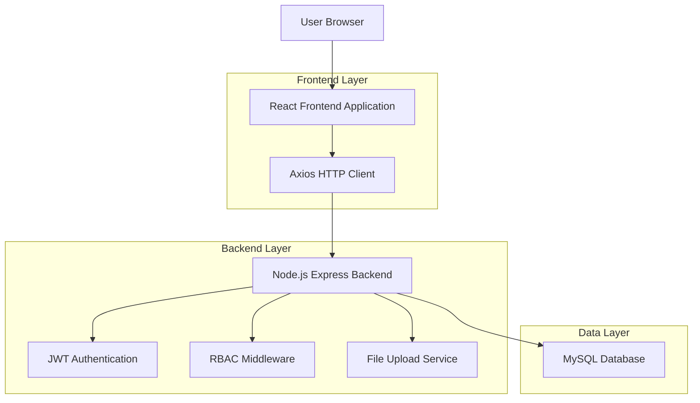
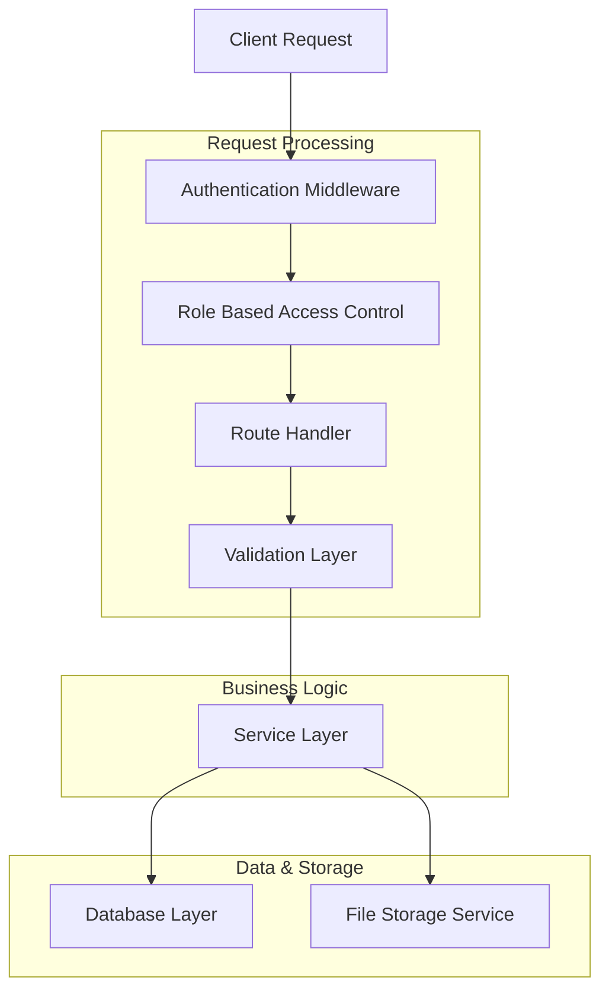
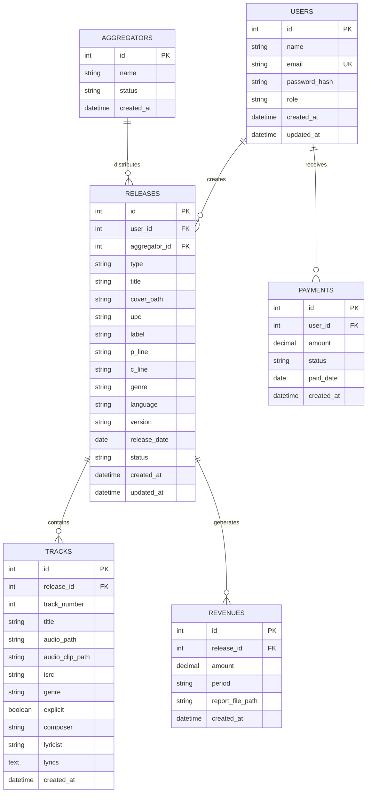

## 1. Architecture Design



## 2. Technology Description

- **Frontend**: React@18 + TailwindCSS@3 + Vite
- **Initialization Tool**: vite-init
- **Backend**: Node.js Express@4
- **Database**: MySQL
- **Authentication**: JWT (jsonwebtoken)
- **Validation**: Joi atau Zod (disarankan Zod untuk TypeScript support)
- **File Upload**: Multer
- **HTTP Client**: Axios
- **Form Management**: React Hook Form
- **State Management**: Context API atau Redux Toolkit (opsional untuk kompleksitas)

## 3. Route Definitions

| Route | Purpose |
|-------|---------|
| /login | Halaman login untuk autentikasi user |
| /dashboard | Dashboard utama dengan statistik |
| /releases/new | Form upload release baru (5 step) |
| /releases | Daftar semua release dengan filter |
| /releases/:id | Detail release lengkap |
| /reports/statistics | Halaman statistik dan chart |
| /reports/revenue | Daftar revenue per release |
| /reports/payments | Manajemen pembayaran ke artist |
| /reports/upload | Upload laporan CSV/Excel |
| /settings/aggregators | Pengaturan daftar aggregator |
| /settings/users | Manajemen user dan roles |

## 4. API Definitions

### 4.1 Authentication APIs

**Login**
```
POST /api/auth/login
```

Request:
| Param Name | Param Type | isRequired | Description |
|------------|------------|------------|-------------|
| email | string | true | Email user |
| password | string | true | Password user |

Response:
| Param Name | Param Type | Description |
|------------|------------|-------------|
| token | string | JWT token untuk autentikasi |
| user | object | Data user (id, name, email, role) |

Example:
```json
{
  "email": "artist@example.com",
  "password": "password123"
}
```

### 4.2 Release APIs

**Create New Release**
```
POST /api/releases
```

Request:
| Param Name | Param Type | isRequired | Description |
|------------|------------|------------|-------------|
| type | string | true | Tipe release: 'single' atau 'album' |
| title | string | true | Judul release |
| cover | file | true | File cover image |
| upc | string | false | UPC code (optional) |
| label | string | true | Record label |
| genre | string | true | Genre musik |
| release_date | date | true | Tanggal rilis |

**Get All Releases**
```
GET /api/releases
```

Query Parameters:
| Param Name | Param Type | Description |
|------------|------------|-------------|
| status | string | Filter by status (pending, review, accepted) |
| user_id | string | Filter by user (khusus admin/operator) |
| page | number | Halaman untuk pagination |
| limit | number | Jumlah item per halaman |

**Update Release Status**
```
PATCH /api/releases/:id/status
```

Request:
| Param Name | Param Type | isRequired | Description |
|------------|------------|------------|-------------|
| status | string | true | Status baru: 'review' atau 'accepted' |
| aggregator_id | string | false | ID aggregator (wajib jika status 'review') |

### 4.3 Track APIs

**Add Track to Release**
```
POST /api/releases/:release_id/tracks
```

Request:
| Param Name | Param Type | isRequired | Description |
|------------|------------|-------------|
| audio_file | file | true | File audio WAV |
| audio_clip | file | true | File audio clip 60s |
| title | string | true | Judul track |
| track_number | number | true | Nomor urut track |
| isrc | string | false | ISRC code |
| genre | string | true | Genre track |
| explicit | boolean | true | Explicit content flag |

### 4.4 Revenue APIs

**Get Revenue Report**
```
GET /api/reports/revenue
```

Query Parameters:
| Param Name | Param Type | Description |
|------------|------------|-------------|
| start_date | date | Tanggal awal periode |
| end_date | date | Tanggal akhir periode |
| user_id | string | Filter by user |

**Upload Revenue Report**
```
POST /api/reports/upload
```

Request:
| Param Name | Param Type | isRequired | Description |
|------------|------------|-------------|
| report_file | file | true | File CSV/Excel |
| period | string | true | Periode laporan |

## 5. Server Architecture Diagram



## 6. Data Model

### 6.1 Database Schema



### 6.2 Data Definition Language

**Users Table**
```sql
CREATE TABLE users (
    id INT PRIMARY KEY AUTO_INCREMENT,
    name VARCHAR(255) NOT NULL,
    email VARCHAR(255) UNIQUE NOT NULL,
    password_hash VARCHAR(255) NOT NULL,
    role ENUM('admin', 'operator', 'user') DEFAULT 'user',
    created_at TIMESTAMP DEFAULT CURRENT_TIMESTAMP,
    updated_at TIMESTAMP DEFAULT CURRENT_TIMESTAMP ON UPDATE CURRENT_TIMESTAMP
);

CREATE INDEX idx_users_email ON users(email);
CREATE INDEX idx_users_role ON users(role);
```

**Aggregators Table**
```sql
CREATE TABLE aggregators (
    id INT PRIMARY KEY AUTO_INCREMENT,
    name VARCHAR(255) NOT NULL,
    status ENUM('active', 'inactive') DEFAULT 'active',
    created_at TIMESTAMP DEFAULT CURRENT_TIMESTAMP
);
```

**Releases Table**
```sql
CREATE TABLE releases (
    id INT PRIMARY KEY AUTO_INCREMENT,
    user_id INT NOT NULL,
    aggregator_id INT,
    type ENUM('single', 'album') NOT NULL,
    title VARCHAR(255) NOT NULL,
    cover_path VARCHAR(500),
    upc VARCHAR(20),
    label VARCHAR(255),
    p_line VARCHAR(255),
    c_line VARCHAR(255),
    genre VARCHAR(100),
    language VARCHAR(50),
    version VARCHAR(100),
    release_date DATE,
    status ENUM('pending', 'review', 'accepted') DEFAULT 'pending',
    created_at TIMESTAMP DEFAULT CURRENT_TIMESTAMP,
    updated_at TIMESTAMP DEFAULT CURRENT_TIMESTAMP ON UPDATE CURRENT_TIMESTAMP,
    FOREIGN KEY (user_id) REFERENCES users(id) ON DELETE CASCADE,
    FOREIGN KEY (aggregator_id) REFERENCES aggregators(id) ON DELETE SET NULL
);

CREATE INDEX idx_releases_user_id ON releases(user_id);
CREATE INDEX idx_releases_status ON releases(status);
CREATE INDEX idx_releases_created_at ON releases(created_at DESC);
```

**Tracks Table**
```sql
CREATE TABLE tracks (
    id INT PRIMARY KEY AUTO_INCREMENT,
    release_id INT NOT NULL,
    track_number INT NOT NULL,
    title VARCHAR(255) NOT NULL,
    audio_path VARCHAR(500) NOT NULL,
    audio_clip_path VARCHAR(500) NOT NULL,
    isrc VARCHAR(20),
    genre VARCHAR(100),
    explicit BOOLEAN DEFAULT FALSE,
    composer VARCHAR(255),
    lyricist VARCHAR(255),
    lyrics TEXT,
    created_at TIMESTAMP DEFAULT CURRENT_TIMESTAMP,
    FOREIGN KEY (release_id) REFERENCES releases(id) ON DELETE CASCADE
);

CREATE INDEX idx_tracks_release_id ON tracks(release_id);
```

**Revenues Table**
```sql
CREATE TABLE revenues (
    id INT PRIMARY KEY AUTO_INCREMENT,
    release_id INT NOT NULL,
    amount DECIMAL(10,2) NOT NULL,
    period VARCHAR(20) NOT NULL,
    report_file_path VARCHAR(500),
    created_at TIMESTAMP DEFAULT CURRENT_TIMESTAMP,
    FOREIGN KEY (release_id) REFERENCES releases(id) ON DELETE CASCADE
);

CREATE INDEX idx_revenues_release_id ON revenues(release_id);
CREATE INDEX idx_revenues_period ON revenues(period);
```

**Payments Table**
```sql
CREATE TABLE payments (
    id INT PRIMARY KEY AUTO_INCREMENT,
    user_id INT NOT NULL,
    amount DECIMAL(10,2) NOT NULL,
    status ENUM('paid', 'unpaid') DEFAULT 'unpaid',
    paid_date DATE,
    created_at TIMESTAMP DEFAULT CURRENT_TIMESTAMP,
    FOREIGN KEY (user_id) REFERENCES users(id) ON DELETE CASCADE
);

CREATE INDEX idx_payments_user_id ON payments(user_id);
CREATE INDEX idx_payments_status ON payments(status);
```

**Dummy Data Seed**
```sql
-- Insert default admin user
INSERT INTO users (name, email, password_hash, role) VALUES 
('Admin', 'admin@musicaggregator.com', '$2b$10$92IXUNpkjO0rOQ5byMi.Ye4oKoEa3Ro9llC/.og/at2.uheWG/igi', 'admin'),
('Operator', 'operator@musicaggregator.com', '$2b$10$92IXUNpkjO0rOQ5byMi.Ye4oKoEa3Ro9llC/.og/at2.uheWG/igi', 'operator');

-- Insert sample aggregators
INSERT INTO aggregators (name, status) VALUES 
('DistroKid', 'active'),
('TuneCore', 'active'),
('CD Baby', 'active'),
('LANDR', 'active');
```